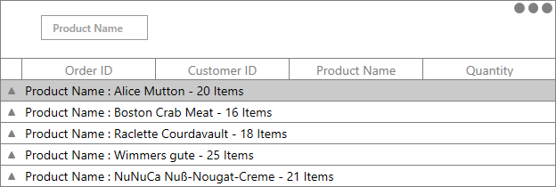

# How to skip the sorting when group the columns in WPF DataGrid (SfDataGrid) ?

## About the sample

This sample shows how to skip sorting when grouping the column in WPF DataGrid (SfDataGrid).
 
[WPF DataGrid](https://www.syncfusion.com/wpf-ui-controls/datagrid) (SfDataGrid) sorts the column while grouping. You can group the column without allowing it to sort by removing the grouped columns from SortDescriptions.

```c#

this.dataGrid.Loaded += OnDataGrid_Loaded;

private void OnDataGrid_Loaded(object sender, RoutedEventArgs e)
{
    this.dataGrid.View.CurrentChanged += OnView_CurrentChanged;
}

private void OnView_CurrentChanged(object sender, EventArgs e)
{
    var groupColumn = dataGrid.View.SortDescriptions.FirstOrDefault(x => x.PropertyName == "ProductName");

    if (dataGrid.SortColumnDescriptions.FirstOrDefault(x => x.ColumnName == "ProductName") != null)
        dataGrid.View.SortDescriptions.Remove(groupColumn);
}

```



KB article - [How to skip the sorting when group the columns in WPF DataGrid (SfDataGrid)?](https://www.syncfusion.com/kb/12027/how-to-skip-the-sorting-when-group-the-columns-in-wpf-datagrid-sfdatagrid)

## Requirements to run the demo
Visual Studio 2015 and above versions

