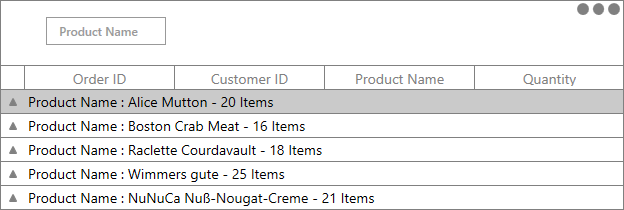

# How to Skip the Sorting When Group the Columns in WPF DataGrid?

This sample shows how to skip sorting when grouping the column in [WPF DataGrid](https://www.syncfusion.com/wpf-controls/datagrid) (SfDataGrid).
 
`DataGrid` sorts the column while grouping. You can group the column without allowing it to sort by removing the grouped columns from [SortDescriptions](https://help.syncfusion.com/cr/wpf/Syncfusion.Data.CollectionViewAdv.html#Syncfusion_Data_CollectionViewAdv_SortDescriptions).

```c#
this.dataGrid.Loaded += OnDataGrid_Loaded;

private void OnDataGrid_Loaded(object sender, RoutedEventArgs e)
{
    this.dataGrid.View.CurrentChanged += OnView_CurrentChanged;
}

private void OnView_CurrentChanged(object sender, EventArgs e)
{
    var groupColumn = dataGrid.View.SortDescriptions.FirstOrDefault(x => x.PropertyName == "ProductName");

    if (dataGrid.SortColumnDescriptions.FirstOrDefault(x => x.ColumnName == "ProductName") != null)
        dataGrid.View.SortDescriptions.Remove(groupColumn);
}
```



## Requirements to run the demo
Visual Studio 2015 and above versions